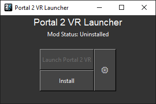
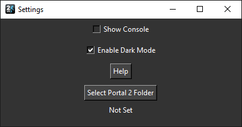
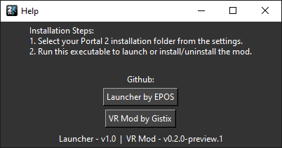

<p align="right">
  
</p>

<h1 align="left">Portal 2 VR Launcher</h1>

<p align="left">
  <strong>A Launcher made for the <a href="https://github.com/Gistix/portal2vr">Portal 2 VR Mod</a><br>The mod which allows you to experience the entire Portal 2 Campaign using VR</strong>
</p>

[](https://www.youtube.com/watch?v=nQZ601kEDFI)
<br>
Portal 2 VR Mod First 20 Minutes (Youtube Video)

<br>

## Why this launcher
I made this launcher so it becomes alot easier to run the mod, with just a few clicks you can:
* Launch
* Install
* Uninstall

Without ever needing to go into the games files! (launcher comes with the latest VR Mod files preincluded)
<br><br>




<br>

## How to use
1. Download [portal2_vr_launcher.exe](https://github.com/EPOS05/portal2vr_launcher/releases/latest) and run the executable
2. Go into the settings and select your Portal 2 installation folder
3. Once selected, go to the main menu and click **Install**
4. After it is done installing, press **Launch Portal 2 VR** and the game should launch with the VR Mod enabled

<br>

## Build instructions
1. Clone this repository
2. Run ``` pyinstaller build.spec ``` (make sure you have the required dependencies)
3. portal2_vr_launcher.exe should be located in the dist folder

<br>

## Original mod
Make sure you check out the original [Portal 2 VR Github Page](https://github.com/Gistix/portal2vr), non of this would have been possible without it.

<br>

## Support me
<a href='https://ko-fi.com/epos05'></a>
<br>
<a href='https://x.com/RealEPOS'>Follow me on X</a>